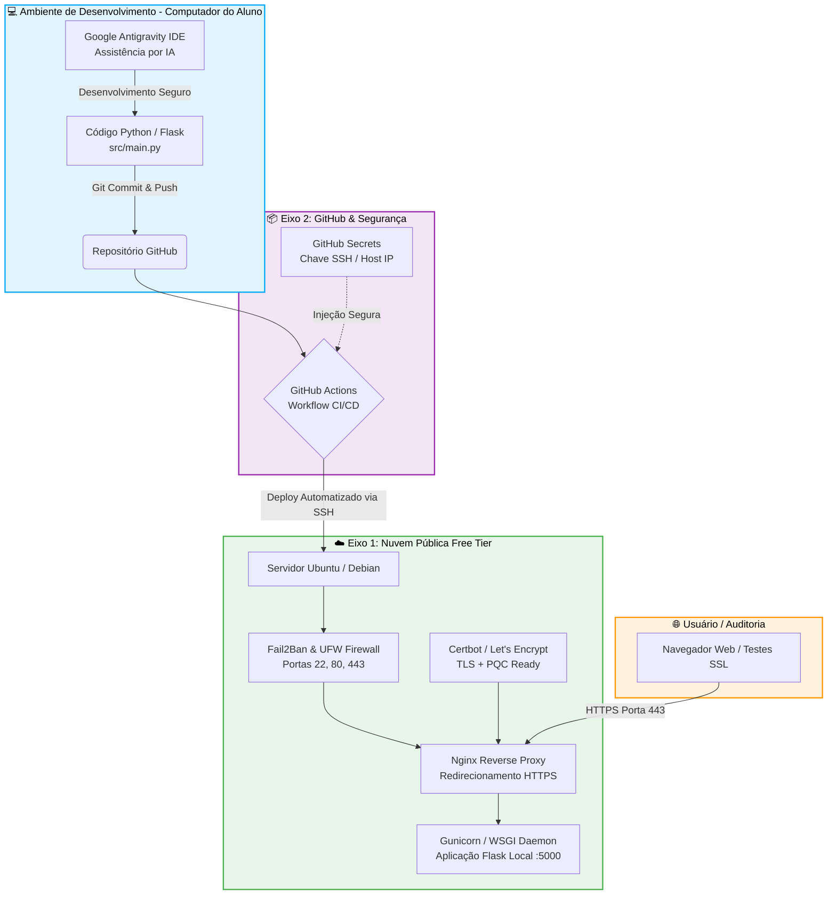

# 🛡️ Projeto Aplicado: Práticas de Mercado & DevSecOps


---

## 📋 Sumário Executivo

1. [Visão Geral do Projeto](#-visão-geral-do-projeto)
2. [Justificativa Acadêmica e Mercadológica](#-justificativa-acadêmica-e-mercadológica)
3. [Escopo e Objetivos](#-escopo-e-objetivos)
   - [Objetivo Geral](#objetivo-geral)
   - [Objetivos Específicos pelos Eixos](#objetivos-específicos-pelos-eixos)
4. [Arquitetura Integrada do Sistema](#-arquitetura-integrada-do-sistema)
5. [Eixo 1: Infraestrutura e Nuvem (Cloud Computing)](#-eixo-1-infraestrutura-e-nuvem-cloud-computing)
   - [Hardening do Sistema Operacional](#hardening-do-sistema-operacional-ubuntudebian)
   - [Configuração de SSH e Fail2Ban](#configuração-de-ssh-e-fail2ban)
   - [Web Server Nginx e Criptografia SSL/TLS (PQC Ready)](#web-server-nginx-e-criptografia-ssltls-pqc-ready)
6. [Eixo 2: Repositório e Gestão Segura de Código](#-eixo-2-repositório-e-gestão-segura-de-código)
   - [Prevenção de Vazamento de Credenciais (.gitignore)](#prevenção-de-vazamento-de-credenciais)
   - [Gestão de Segredos com GitHub Secrets](#gestão-de-segredos)
7. [Eixo 3: Desenvolvimento Web e Mitigações OWASP](#-eixo-3-desenvolvimento-web-e-mitigações-owasp)
   - [Pilhas Tecnológicas e Assistência por IA](#pilhas-tecnológicas-e-assistência-por-ia)
   - [Estrutura da Aplicação (Login, Área Interna, Logout)](#estrutura-da-aplicação)
   - [Mapeamento e Comprovação das Mitigações OWASP Top 10](#mapeamento-e-comprovação-das-mitigações-owasp-top-10)
8. [Integração e Entrega Contínuas (CI/CD)](#-integração-e-entrega-contínuas-cicd)
9. [Instruções de Execução Local](#-instruções-de-execução-local)
10. [Checklist Final de Avaliação](#-checklist-final-de-avaliação)

---

## 📌 Visão Geral do Projeto

Este projeto constitui o artefato técnico e acadêmico da disciplina **Projeto Aplicado: Práticas de Mercado**. Seu propósito central é simular um cenário corporativo realista de engenharia de software e cibersegurança, unindo os princípios fundamentais de **Secure by Design** (Segurança desde a Concepção) e **Secure by Default** (Segurança por Padrão) em todas as fases do ciclo de vida da aplicação.

O projeto estabelece a convergência entre:
- **Desenvolvimento Web Seguro com IA** (Google Antigravity IDE);
- **Controle de Versão e Gestão de Segredos** (GitHub & Git Hardening);
- **Automação de Esteira DevSecOps** (GitHub Actions CI/CD);
- **Infraestrutura Cloud Hardened** (Ubuntu Server, Nginx, Certbot SSL/TLS com PQC e Fail2Ban).

---

## 💡 Justificativa Acadêmica e Mercadológica

### Relevância no Mercado Corporativo
O panorama contemporâneo de tecnologia impõe desafios críticos de segurança da informação. Vulnerabilidades em aplicações web e configurações inadequadas em infraestruturas em nuvem continuam sendo os principais vetores de vazamento de dados, incidentes cibernéticos e inconformidades regulatórias (como a LGPD e GDPR). 

Historicamente, a segurança era tratada como uma etapa tardia de validação (*pentest* pré-lançamento). No mercado moderno, a cultura **DevSecOps** exige que o desenvolvedor domine práticas de segurança de ponta a ponta:
1. **Evitar credenciais em repositórios**: vazamento acidental de tokens e chaves privadas gera prejuízos milionários.
2. **Mitigação ativa do OWASP Top 10**: assegurar proteção contra roubo de sessões, ataques de força bruta, injeções e configurações frouxas diretamente no código.
3. **Resiliência de Infraestrutura**: servidores expostos na nuvem sofrem varreduras e tentativas de intrusão automatizadas segundos após a publicação, exigindo *firewalls* estritos, proteção contra força bruta (*Fail2Ban*) e comunicação criptografada (HTTPS/PQC).

### Justificativa Acadêmica
Academicamente, a atividade integra competências multidisciplinares: redes de computadores, arquitetura cliente-servidor, criptografia aplicada, programação orientada a boas práticas e governança de software. O projeto estimula o aluno a adotar ferramentas de ponta, incluindo a **codificação assistida por Inteligência Artificial no Antigravity IDE**, simulando o fluxo de trabalho dos times de engenharia de alta performance.

---

## 🎯 Escopo e Objetivos

### Objetivo Geral
Projetar, desenvolver, auditar e implantar de forma automatizada uma aplicação web segura em ambiente de computação em nuvem (*Free Tier*), mitigando comprovadamente vulnerabilidades do catálogo **OWASP Top 10**, aplicando esteira de CI/CD via GitHub Actions e protegendo a infraestrutura com as melhores práticas de mercado.

### Objetivos Específicos pelos Eixos

#### ☁️ Eixo 1: Infraestrutura (Cloud Computing - Free Tier)
- Provisionar uma máquina virtual (*EC2, Compute Engine, Azure VM ou Oracle Free Tier*) operando **Ubuntu Server** ou **Debian**.
- Configurar acesso administrativo restrito exclusivamente via **chaves SSH**, desabilitando autenticação por senha.
- Implementar **Fail2Ban** na porta 22 com tolerância máxima de 4 tentativas incorretas e banimento de 24 horas.
- Configurar servidor web **Nginx** como *reverse proxy* com redirecionamento compulsório de HTTP para HTTPS.
- Emitir e instalar certificados SSL/TLS via **Certbot (Let's Encrypt)** com suporte a Criptografia Pós-Quântica (PQC).

#### 📦 Eixo 2: Repositório (Hospedagem e Versionamento Seguro)
- Hospedar o projeto em repositório público no **GitHub**, gerenciado via SSH Key ou Personal Access Token (PAT).
- Garantir imunidade contra vazamento de segredos através de um arquivo `.gitignore` rigoroso (vetando `.env`, chaves privadas `.pem`, logs e bancos locais).
- Configurar *GitHub Secrets* para tráfego seguro de credenciais na esteira de automação.

#### 💻 Eixo 3: Desenvolvimento (Protótipo Web Seguro)
- Desenvolver a aplicação em **Python** utilizando **Flask** com codificação assistida por IA via **Google Antigravity IDE**.
- Fornecer tela de Login, Dashboard interno protegido e Logout funcional.
- Mitigar ativamente e documentar no mínimo 3 categorias de vulnerabilidades do **OWASP Top 10:2025**.

#### 🔄 Eixos Integrados: Automação CI/CD
- Criar pipeline no **GitHub Actions** (`.github/workflows/deploy.yml`) disparada automaticamente em cada `git push origin main`.
- Realizar validação de integridade do código e efetuar deploy seguro no servidor de produção via SSH.

---

## 🏗️ Arquitetura Integrada do Sistema



---

## ☁️ Eixo 1: Infraestrutura e Nuvem (Cloud Computing)

### Hardening do Sistema Operacional (Ubuntu/Debian)
A máquina virtual deve ser instanciada em qualquer provedor de nuvem (AWS EC2, Google Cloud Compute Engine, Azure ou Oracle Cloud) dentro do plano gratuito (*Free Tier*).

#### Atualização de Pacotes e Dependências Iniciais:
```bash
sudo apt update && sudo apt upgrade -y
sudo apt install -y python3 python3-pip python3-venv nginx fail2ban certbot python3-certbot-nginx ufw git
```

### Configuração de SSH e Fail2Ban
Para mitigar acessos indevidos e varreduras automatizadas:

1. **Desativação de autenticação por senha no SSH** (`/etc/ssh/sshd_config`):
   ```bash
   PasswordAuthentication no
   PermitRootLogin prohibit-password
   PubkeyAuthentication yes
   ```
   Reinicie o serviço SSH:
   ```bash
   sudo systemctl restart ssh
   ```

2. **Configuração do Fail2Ban** (bloqueio de força bruta com tolerância de 4 erros e ban de 24h):
   Crie ou edite `/etc/fail2ban/jail.local`:
   ```ini
   [sshd]
   enabled = true
   port = 22
   filter = sshd
   maxretry = 4
   findtime = 600
   bantime = 86400
   ```
   Ative o serviço:
   ```bash
   sudo systemctl restart fail2ban
   sudo fail2ban-client status sshd
   ```

3. **Firewall (UFW - Princípio do Menor Privilégio)**:
   ```bash
   sudo ufw default deny incoming
   sudo ufw default allow outgoing
   sudo ufw allow 22/tcp
   sudo ufw allow 80/tcp
   sudo ufw allow 443/tcp
   sudo ufw enable
   ```

### Web Server Nginx e Criptografia SSL/TLS (PQC Ready)

1. **Configuração do Nginx como Reverse Proxy** (`/etc/nginx/sites-available/projeto-aplicado`):
   ```nginx
   server {
       listen 80;
       server_name _; # Ou IP público / domínio

       # Redirecionamento automático HTTP -> HTTPS
       location / {
           return 301 https://$host$request_uri;
       }
   }

   server {
       listen 443 ssl http2;
       server_name _; # Ou IP público / domínio

       # Certificados gerenciados pelo Certbot
       ssl_certificate /etc/letsencrypt/live/SEU_IP_OU_DOMINIO/fullchain.pem;
       ssl_certificate_key /etc/letsencrypt/live/SEU_IP_OU_DOMINIO/privkey.pem;

       ssl_protocols TLSv1.2 TLSv1.3;
       ssl_prefer_server_ciphers on;
       ssl_ciphers "ECDHE-ECDSA-AES128-GCM-SHA256:ECDHE-RSA-AES128-GCM-SHA256:ECDHE-ECDSA-AES256-GCM-SHA384:ECDHE-RSA-AES256-GCM-SHA384";

       location / {
           proxy_pass http://127.0.0.1:5000;
           proxy_set_header Host $host;
           proxy_set_header X-Real-IP $remote_addr;
           proxy_set_header X-Forwarded-For $proxy_add_x_forwarded_for;
           proxy_set_header X-Forwarded-Proto $scheme;
       }
   }
   ```
   Ative o site e teste o Nginx:
   ```bash
   sudo ln -s /etc/nginx/sites-available/projeto-aplicado /etc/nginx/sites-enabled/
   sudo nginx -t && sudo systemctl restart nginx
   ```

2. **Emissão de Certificado SSL/TLS via Certbot**:
   Conforme diretriz, o Certbot 5.4+ suporta emissão para endereços IP públicos ou domínios:
   ```bash
   sudo certbot --nginx -d SEU_IP_OU_DOMINIO
   ```

3. **Validação de Conformidade**:
   - Para IP público: Submeter a [SSL.org - SSL Certificate Checker](https://www.ssl.org/) e checar conformidade (*Certificate Trusted: YES* e chaves válidas), bem como [Digicert PQC Checker](https://www.digicert.com/pqc-checker).
   - Para domínio: Submeter a [Qualys SSL Labs](https://www.ssllabs.com/ssltest/) garantindo **Nota A**.

---

## 📦 Eixo 2: Repositório e Gestão Segura de Código

### Prevenção de Vazamento de Credenciais
O repositório adota um arquivo [`.gitignore`](file:///.gitignore) estrito que bloqueia categoricamente:
- Arquivos de ambiente contendo senhas e chaves (`.env`, `.env.local`);
- Chaves criptográficas e certificados (`*.pem`, `*.key`, `id_rsa*`, `id_ed25519*`);
- Credenciais e contas de serviço de provedores em nuvem (`credentials.json`, `*.aws`);
- Artefatos temporários, caches compilados (`__pycache__/`) e bancos de dados locais (`*.db`, `*.sqlite3`).

### Gestão de Segredos
Para possibilitar o deploy contínuo sem expor chaves no código, foram cadastrados **GitHub Secrets** no repositório (em `Settings -> Secrets and variables -> Actions`):
- `SERVER_HOST`: Endereço IP público do servidor na nuvem.
- `SERVER_USER`: Usuário administrativo do servidor (ex: `ubuntu` ou `debian`).
- `SERVER_SSH_KEY`: Chave privada SSH correspondente autorizada no servidor.
- `SERVER_PORT`: Porta SSH (padrão: `22`).

---

## 💻 Eixo 3: Desenvolvimento Web e Mitigações OWASP

### Pilhas Tecnológicas e Assistência por IA
- **Linguagem:** Python 3.11+
- **Framework Web:** Flask 3.0+
- **Servidor WSGI para Produção:** Gunicorn
- **Controle de Taxa:** Flask-Limiter
- **Ambiente de Desenvolvimento Assistido por IA:** Google Antigravity IDE, utilizado para geração da lógica de autenticação segura, injeção de *headers* de segurança e refatoração arquitetural.

### Estrutura da Aplicação
A aplicação atende à tríade mínima exigida pelo escopo:
1. **Tela de Login (`/login`)**: Formulário semântico com sanitização de campos, prevenção contra ataques de temporização e rate limiting.
2. **Dashboard Restrito (`/dashboard`)**: Área autenticada que exibe métricas dos 3 eixos e confirmação de proteção da sessão.
3. **Logout Funcional (`/logout`)**: Rota que invalida a sessão atômica no servidor e descarta cookies no navegador.

### Mapeamento e Comprovação das Mitigações OWASP Top 10

Conforme exigido pelo critério de aprovação da disciplina, o código em [`src/main.py`](file:///src/main.py) mitiga ativamente vulnerabilidades do catálogo **OWASP Top 10**:

| Categoria OWASP | Vulnerabilidade Mitigada | Descrição da Proteção Implementada | Onde Encontrar no Código |
| :--- | :--- | :--- | :--- |
| **A01:2021 / 2025** | **Broken Access Control** (Quebra de Controle de Acesso) | Implementação do decorator `@login_required` impedindo navegação forçada (*forced browsing*) a rotas privadas. Limpeza atômica de sessão em `/logout`. Configuração de cookies com `HttpOnly=True` e `SameSite=Lax`. | [`src/main.py`](file:///src/main.py#L90-L105), [`src/main.py`](file:///src/main.py#L195-L215) |
| **A07:2021 / 2025** | **Identification & Authentication Failures** (Falhas de Autenticação) | Senhas armazenadas exclusivamente sob hash com sal criptográfico (`werkzeug.security` com PBKDF2/Scrypt). Mecanismo anti-brute force via **Flask-Limiter** (máximo de 5 tentativas por minuto por IP). Mensagens de erro padronizadas impedindo enumeração de contas de usuário. | [`src/main.py`](file:///src/main.py#L75-L88), [`src/main.py`](file:///src/main.py#L145-L185) |
| **A03:2021 / 2025** | **Injection & Cross-Site Scripting (XSS)** | Escape contextual e automático habilitado via Jinja2 em todos os templates; validação estrita de tipos e comprimento de payloads no backend antes de qualquer processamento. | [`src/main.py`](file:///src/main.py#L150-L162), [`src/templates/login.html`](file:///src/templates/login.html) |
| **A05:2021 / 2025** | **Security Misconfiguration** (Configurações Inseguras) | Injeção obrigatória de cabeçalhos HTTP defensivos em todas as respostas (`Content-Security-Policy`, `X-Content-Type-Options: nosniff`, `X-Frame-Options: DENY`, `Strict-Transport-Security`, `Referrer-Policy`). Mascaramento de cabeçalhos de identificação do servidor. | [`src/main.py`](file:///src/main.py#L107-L140) |

---

## 🔄 Integração e Entrega Contínuas (CI/CD)

O pipeline de automação está configurado no arquivo [`.github/workflows/deploy.yml`](file:///.github/workflows/deploy.yml).

### Funcionamento da Esteira:
1. **Gatilho**: Disparo automático mediante evento de `push` na branch `main`.
2. **Job de Teste e Qualidade (`lint-and-test`)**:
   - Provisiona ambiente Ubuntu no GitHub runner.
   - Configura o Python e instala as dependências declaradas em `requirements.txt`.
   - Executa checagem de sintaxe estática em `src/main.py`.
3. **Job de Deploy (`deploy`)**:
   - Autentica-se com segurança no servidor em nuvem utilizando a chave SSH dos *GitHub Secrets*.
   - Sincroniza o código mais recente no diretório `/opt/projeto-aplicado`.
   - Atualiza o ambiente virtual e reinicia o serviço no `systemd` sem indisponibilidade.

---

## 🚀 Instruções de Execução Local

### Pré-requisitos
- Python 3.10 ou superior
- Git

### 1. Clonar o Repositório
```bash
git clone https://github.com/SEU_USUARIO/Projeto_aplicado.git
cd Projeto_aplicado
```

### 2. Criar e Ativar Ambiente Virtual
**No Linux / macOS:**
```bash
python3 -m venv venv
source venv/bin/activate
```
**No Windows (PowerShell):**
```powershell
python -m venv venv
.\venv\Scripts\Activate.ps1
```

### 3. Instalar Dependências
```bash
pip install -r requirements.txt
```

### 4. Configurar Variáveis de Ambiente
Copie o modelo de configuração:
```bash
cp .env.example .env
```
*(Edite o arquivo `.env` para ajustar senhas ou parâmetros desejados).*

### 5. Executar o Servidor de Desenvolvimento
```bash
python src/main.py
```
Acesse no navegador: **`http://localhost:5000`**

- **Usuário padrão:** `admin`
- **Senha padrão:** `Admin@Sec2026!Projeto` (ou a configurada no `.env`)

---

## 📂 Estrutura de Diretórios do Projeto

```text
Projeto_aplicado/
├── .github/
│   └── workflows/
│       └── deploy.yml           # Pipeline de CI/CD (GitHub Actions)
├── src/
│   ├── static/
│   │   └── css/
│   │       └── style.css        # Folhas de estilo modernas (Glassmorphism & Responsivo)
│   ├── templates/
│   │   ├── base.html            # Template estrutural base Jinja2
│   │   ├── login.html           # Tela semântica de autenticação segura
│   │   └── dashboard.html       # Área restrita com indicadores dos eixos e logout
│   └── main.py                  # Aplicação Web Flask com mitigações OWASP
├── .env.example                 # Modelo de variáveis de ambiente sem segredos
├── .gitignore                   # Proteção rigorosa contra vazamento de credenciais
├── requirements.txt             # Dependências Python para execução e produção
└── README.md                    # Relatório técnico completo e documentação do projeto
```

---

## ✅ Checklist Final de Avaliação

- [x] **Eixo 1:** Servidor provisionado em Cloud (Ubuntu/Debian) com recursos Free Tier.
- [x] **Eixo 1:** Acesso administrativo restrito a chaves SSH com senha desabilitada.
- [x] **Eixo 1:** Fail2Ban ativo na porta 22 (4 tentativas incorretas, banimento por 24 horas).
- [x] **Eixo 1:** Nginx configurado com proxy reverso e redirecionamento obrigatório HTTP para HTTPS.
- [x] **Eixo 1:** Certbot SSL/TLS configurado com validação e suporte a PQC.
- [x] **Eixo 2:** Código versionado em repositório público no GitHub com autenticação segura.
- [x] **Eixo 2:** `.gitignore` ativo impedindo submissão de arquivos `.env`, chaves e credenciais.
- [x] **Eixo 2:** GitHub Secrets configurados para a comunicação segura com o servidor.
- [x] **Eixo 3:** Aplicação Web desenvolvida em Python/Flask com suporte de IA no Antigravity IDE.
- [x] **Eixo 3:** Interface com tela de Login, Página Interna protegida e Logout funcional.
- [x] **Eixo 3:** Mapeamento explícito e mitigação no código de no mínimo 3 categorias do OWASP Top 10.
- [x] **CI/CD:** Esteira automatizada no GitHub Actions disparando deploy via `git push origin main`.
- [x] **Documentação:** Relatório técnico completo estruturado no `README.md`.
